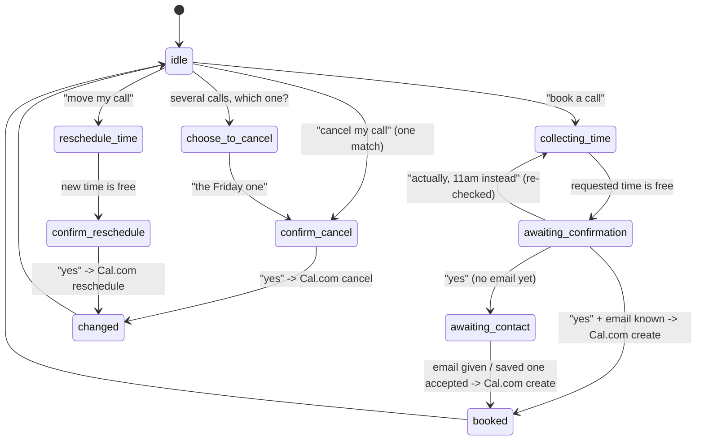

# Sarjy architecture

## One turn

1. **Browser.** Typed text goes straight to `POST /message`. Speech is recorded, sent to
   `POST /transcribe` (OpenAI Whisper, falling back to local faster-whisper, then an offline
   placeholder), shown as "You said", then sent to `/message` like typed text.
2. **Router** (`routers/chat.py`): checks the sign-in token, saves the message, calls the agent,
   saves the reply, and schedules memory extraction to run after the response is sent.
3. **Agent** (`agent/orchestrator.py`):
   1. A "never mind" drops whatever is in progress.
   2. The **input guardrail** blocks jailbreaks and prohibited topics before any LLM or tool call.
   3. It builds a `Turn` (user, message, state, timezone, last 10 messages, remembered facts and
      upcoming calls for the prompt).
   4. "Is my meeting booked?" / "what calls do I have?" are answered from our own records.
   5. Otherwise the message is **routed by conversation state**: a new booking, cancel or move
      request when nothing is in progress, or the handler for the step the chat is on
      (`BookingFlow` / `ChangeFlow`), or plain chat with the LLM.
   6. The **output guardrail** replaces any "booked / cancelled / moved" claim that Cal.com
      didn't confirm in this turn with the facts from our records.
4. **Voice out**: the browser sends the reply to `POST /tts` (OpenAI TTS) and types the text out
   in time with the audio, falling back to the browser's own voice.

## The booking state machine

The state lives in `conversation_states` (one row per chat), so a booking survives questions,
page reloads and switching chats. Every arrow that touches Cal.com is a real API call; every
reply that says something happened is built from its response (`agent/templates.py`).

(`booked` and `changed` behave like `idle` for the next request; "never mind" returns to `idle`
from any step. `choose_to_reschedule` mirrors `choose_to_cancel`.)

## Reliability details

- **No double booking.** Each booking attempt has an idempotency key (chat + event type + slot)
  with a unique index; a repeated "yes" finds the confirmed attempt instead of booking again.
- **No guessing after a timeout.** If Cal.com doesn't answer, the attempt stays `pending` and the
  user is told it's unconfirmed; it's never reported as booked or failed.
- **Retries only where safe.** `core/http.py` retries on 429/5xx and connection errors, but
  booking creation and rescheduling are sent once.
- **The LLM's time reading is validated.** It returns a date, a time and any timezone the user
  named as JSON; the code checks the format, does the timezone conversion and looks the slot up
  on Cal.com. Malformed output means "no time found".
- **Per-stage timings** (`stage=... ms=...`) are logged for every turn with a request id.
